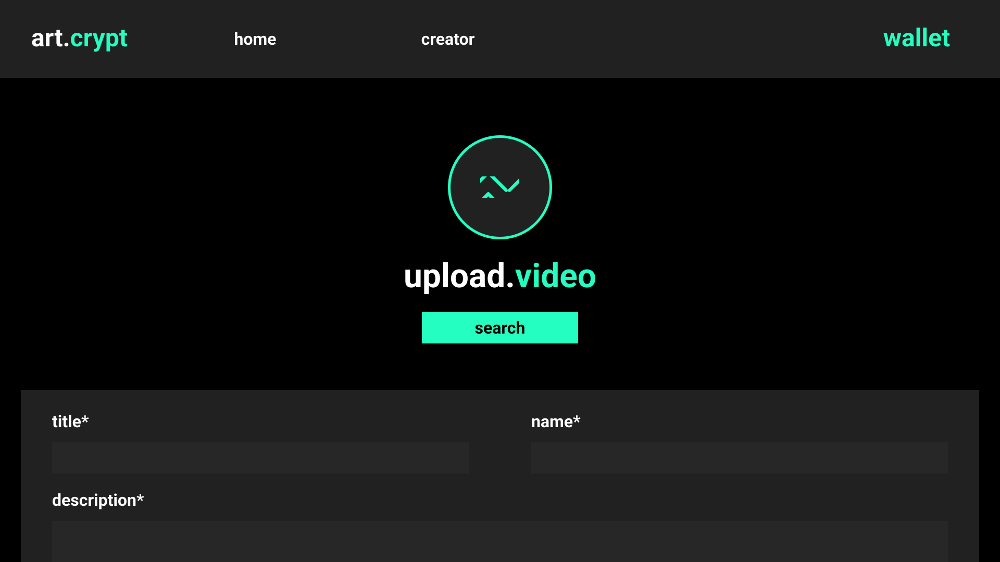

# art.crypto

This project was done during the Ethereum Rio Hackathon which happend mid march 2022. It won the Liveper bounty for best integrating with Livepeer VOD API.

art.crypto is a marketplace where artists can sell NFTs and offer extra contents (mainly video) which can be accessed using the bought NFTs.

    
     
    
     
    

